# CivicSync data model

The MySQL schema is versioned in `src/main/resources/db/migration`. The application validates it at startup. This diagram reflects migration V7.

```mermaid
erDiagram
  USERS ||--o{ CAMPAIGNS : requests
  USERS ||--o{ CAMPAIGNS : verifies
  USERS ||--o{ CAMPAIGNS : assigned_to_review
  USERS ||--o{ DONATIONS : supports
  USERS ||--o{ DONATIONS : confirms_receipt
  USERS ||--o{ CIVIC_REPORTS : reports
  USERS ||--o{ CIVIC_CONFIRMATIONS : confirms
  USERS ||--o{ USER_INTERESTS : selects
  USERS ||--o{ VERIFIER_CATEGORIES : qualifies_for
  USERS ||--o{ NOTIFICATIONS : receives
  USERS ||--o{ DISPUTES : files_or_reviews
  CAMPAIGNS ||--o{ DONATIONS : receives
  CAMPAIGNS ||--o{ CAMPAIGN_ATTACHMENTS : has
  CIVIC_REPORTS ||--o{ CIVIC_CONFIRMATIONS : receives
  USERS ||--o{ COMMENTS : authors
  USERS ||--o{ POST_LIKES : likes

  USERS {
    bigint id PK
    varchar email UK
    varchar password_hash
    varchar full_name
    enum role
    varchar area
    varchar phone
    date date_of_birth
    varchar blood_group
    enum identity_document_type
    varchar identity_document_file
    boolean donor_opt_in
    boolean email_alerts_enabled
    datetime last_blood_donation_at
    varchar verifier_code UK
    varchar language
    boolean reminders_enabled
    boolean legacy_role_needs_review
  }
  CAMPAIGNS {
    bigint id PK
    bigint requester_id FK
    bigint verified_by FK
    bigint requested_verifier_id FK
    enum category
    enum status
    varchar title
    varchar location
    double latitude
    double longitude
    double goal_amount
    double raised_amount
    varchar patient_name
    varchar blood_type
    int units_needed
    varchar hospital
    enum urgency
    varchar verification_note
    datetime info_requested_at
    varchar outcome_summary
    varchar outcome_proof_url
    boolean outcome_approved
  }
  DONATIONS {
    bigint id PK
    bigint campaign_id FK
    bigint donor_id FK
    bigint confirmed_by_id FK
    enum type
    enum status
    double amount
    varchar contact_phone
    datetime confirmed_at
  }
  CIVIC_REPORTS {
    bigint id PK
    bigint reporter_id FK
    double latitude
    double longitude
    enum status
    int confirmation_count
    datetime last_confirmed_at
  }
  CIVIC_CONFIRMATIONS {
    bigint id PK
    bigint report_id FK
    bigint user_id FK
  }
  SYMPTOM_REPORTS {
    bigint id PK
    varchar area
    varchar symptom
    datetime reported_at
  }
  USER_INTERESTS {
    bigint user_id PK,FK
    enum category PK
  }
  VERIFIER_CATEGORIES {
    bigint user_id PK,FK
    enum category PK
  }
  CAMPAIGN_ATTACHMENTS {
    bigint id PK
    bigint campaign_id FK
    varchar file_name
  }
  COMMENTS {
    bigint id PK
    bigint author_id FK
    enum post_type
    bigint post_id
  }
  POST_LIKES {
    bigint id PK
    bigint user_id FK
    enum post_type
    bigint post_id
  }
  NOTIFICATIONS {
    bigint id PK
    bigint user_id FK
    varchar dedupe_key
    varchar message_key
    varchar message
    bigint campaign_id
    boolean read_state
  }
  DISPUTES {
    bigint id PK
    bigint created_by_id FK
    bigint reviewed_by_id FK
    enum post_type
    bigint post_id
    enum status
    enum action
  }
```

Comments, likes, and disputes use a `post_type` plus `post_id` pair because they can refer to either campaigns or civic reports. The service checks the target and visibility; MySQL cannot enforce that polymorphic pair with one foreign key. Symptom reports deliberately have no user foreign key, so the public form does not store the reporter's identity.

## Trust rules

- Campaign status moves from `PENDING` to `VERIFIED`, `REJECTED`, or `INFO_REQUESTED`. A requester can edit and resubmit an `INFO_REQUESTED` campaign, returning it to `PENDING`. Only qualified partners or admins can review; a verifier cannot review their own request.
- A campaign can become `COMPLETED` only after its outcome evidence is approved. Public feeds show `VERIFIED` and `COMPLETED` campaigns.
- Blood campaigns accept `PLEDGE` records only. New monetary records begin at `PENDING_RECEIPT`; the requester moves them to `CONFIRMED`, which adds their amount to the received total.
- `civic_confirmations` has a unique `(report_id, user_id)` key. The reporter cannot confirm their own report. Three different confirmations change a report to `CONFIRMED`.
- `verifier_categories` limits partner queues. Admins assign or change the categories. Public registration always creates a regular user.
- Notifications use a per-user dedupe key and stay in-app. Proof-of-impact and pledge events produce inbox records; alert counts come from anonymous symptom reports over a 14-day window.

## Migration notes

V1 models the original tables. V2 adds accounts, evidence, donations, disputes, and inbox data while treating existing monetary donations as confirmed and preserving historical totals. V3 adds campaign coordinates. V4 adds dispute moderation action. V5 retains category access for legacy verifiers while flagging elevated accounts for review. V6 adds blood details, verifier feedback states, pledge contact, and civic confirmation time. Existing rows keep nullable fields where the older app did not collect them.
